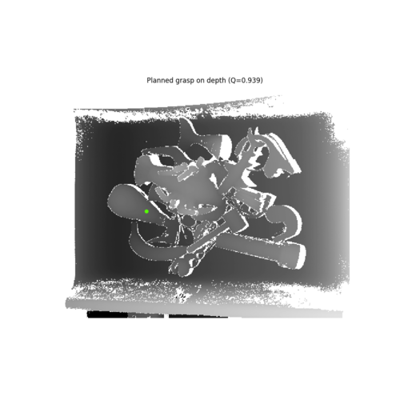
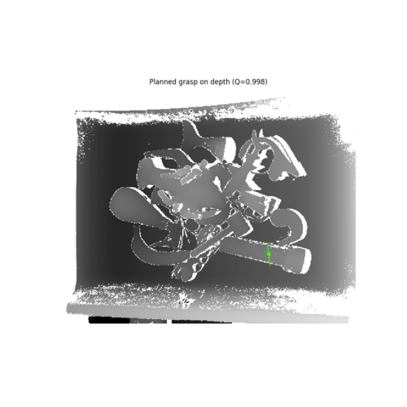

# Install
First, install [Docker](https://docs.docker.com/get-docker/) and, optionally, [nvidia-docker](https://github.com/NVIDIA/nvidia-docker) (if using GPUs locally). You will also need [ROS](http://wiki.ros.org/ROS/Installation) installed.

Then, clone this repo to your local `catkin_ws` and build the workspace: 
```shell
cd /path/to/catkin_ws/src
git clone https://github.com/mjd3/gqcnn-ros.git
cd ..
catkin_make
```

Also, install python dependencies for the client. As always, a virtual environment is recommended.
```shell
pip install autolab_core visualization autolab_perception
```

# Build Docker Images
From the root directory of this project, run the following command (where `GRIPPER_TYPE` should be replaced with `suction` or `pj` and `GPU/CPU` should be replaced with `cpu` or `gpu`):
```shell
docker build -f docker/Dockerfile_<GRIPPER_TYPE>_<GPU/CPU>.ros . -t gqcnn_ros:<GRIPPER_TYPE>-<GPU/CPU>
```

# CPU Run Example
First, start the docker node (here using the `suction-cpu` image): 
```shell
docker run --network host --rm gqcnn_ros:suction-cpu
```

Then, start the client:
```shell
roslaunch gqcnn_ros gqcnn_ros_client.launch
```

You should see an image saved as `grasp.png` with the planned suction grasp:



# GPU Run Example
For the node, use the `--gpus` option in conjunction with either the `suction-gpu` or `pj-gpu` image to enable inference on the GPU. A full command is shown below: 
```shell
 docker run --gpus all --network host --rm gqcnn_ros:pj-gpu
```

Running this command in conjunction with the following client command above results in the following `grasp.png`:



# Image compression
To enable compressed image transport between client and grasp planner, use the `compress:=true` option for the client launch script.

# Other Client Options
Many other options for the client (such as which image to pass) are available and can be seen by running:
```shell
roslaunch gqcnn_ros gqcnn_ros_client.launch client_args:="-h"
```

In general, these client arguments are passed in the `client_args` roslaunch argument as shown above.

# TODO
Add python deps into `setup.py`.